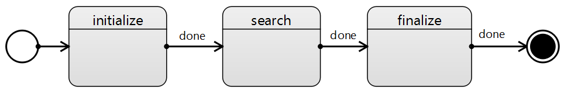
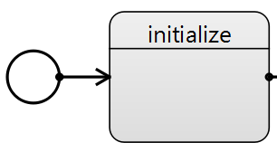
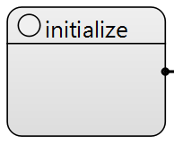
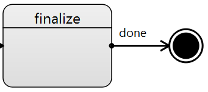
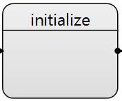
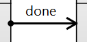

# 1. HelloWorld: сравнение создания StateChart и LangGraph

## Сценарий

Пример демострируем принцип работы Statechart по сравнению с классическим Langraph.
Весь сценарий работы Statechart хранится полностью в файле с раширением *.scxml.
Для редактирования диаграмму можно открыть в Qt Creator.
Загружается диаграмма из statechart_engine, а затем запускается.

Сценарий в примере "Hello, World" линейный, который отлично описывается и LangGraph.



## Как работает LangGraph

1. **Создаётся граф состояний (`WorkflowState`)**

```
class WorkflowState(TypedDict, total=False):
    log: list
    sources: list
    results: list
    pending: int
    success: int
    fail: int
    finalized: bool
    _config: dict
```

WorkflowState — тип общего состояния, которое будет передаваться и модифицироваться узлами графа.

2. **Регистрируются узлы (nodes)**

```
wf = StateGraph(WorkflowState)

wf.add_node("initialize", _node(nodes.initialize))
wf.add_node("search", _node(nodes.search))
wf.add_node("finalize", _node(nodes.finalize))
```

* Каждый узел — это шаг вычисления.

3. **Задаётся точка входа**

```
wf.set_entry_point("initialize")
```

   Граф всегда стартует с узла `initialize`.
4. **Описываются рёбра (переходы)**

```
wf.add_edge("initialize", "search")
wf.add_edge("search", "finalize")
wf.add_edge("finalize", END)
```

5. **Компиляция графа**

```
return wf.compile()
```

На этом этапе граф:

* валидируется,
* превращается в исполняемый объект (runtime),
* фиксируется структура (после compile её обычно нельзя менять).

## Как работает Statechart

Любое исполнение SCXML начинается с незакашгенного круга "initial", указывающий на начальное состояние.
В данном примере это состояние "initialize":

Также можно указать начальное состояние следующим образом для экономии пространства диаграммы:


В файле scxml начальное состояние диаграммы указывается в аттрибуте `<scxml ... initial="initialize"> ... </scxml> `.
Данное поле - это id состояния, которое указывается в аттрибуте `<state id="initialize" ...> ... </state>`.

Завершение диаграммы заканчивается на круге "final":


Финальное состояние указывается тегом final: `<final id="__final__"> ... </final>.`

Основыне элементы диаграммы - это состояния и переходы.
Состояния выглядят следующим образом, где является именем обработчика,
который будет выполнен при поподании в данное состояние:

А переходы стрелкой:


Подпись рядом со стрелкой - это событие перехода.

```
<state id="initialize" node="initialize">
    <transition type="internal" event="done" target="search"></transition>
</state>
```

Сценарий в примере "Hello, World" линейный, который отлично описывается и LangGraph.


Выполняются три последовательных операции (nodes): initialize, search и finalize.
Обработчики в AIStatechart передаются следующим образом:

```
def initialize(state: Dict[str, Any], config: Dict[str, Any]) -> Dict[str, Any]:
   ...

def search(state: Dict[str, Any], config: Dict[str, Any]) -> Dict[str, Any]:
   ...

def finalize(state: Dict[str, Any], config: Dict[str, Any]) -> Dict[str, Any]:
   ...

node_map = {"initialize": nodes.initialize,
            "search": nodes.search,
            "finalize": nodes.finalize}

```

Имя ключа в node_map должно соотвестовать имени состояния в диаграмме scxml.

## Преимущества Statechart

В этом примере используется минимальная линейная схема, которую легко реализовать и через LangGraph, и через statechart.
Такой выбор позволяет сразу показать, что statechart не противоречит привычному подходу и не требует менять стиль разработки на первом шаге.
Statechart позволяет держать правила управления в модели (SCXML), отделяя их от кода узлов.
Цель примера не в том, чтобы показать максимум возможностей, а в том, чтобы зафиксировать базовую точку отсчёта.
Дальше, по мере усложнения сценариев, становится видно где statechart начинает давать преимущество.
