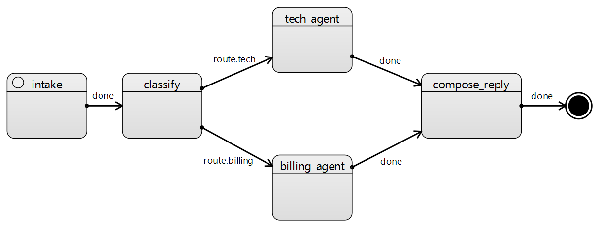

# 2. Branching: маршрутизация запроса

## Сценарий

В систему приходит запрос пользователя. Классификатор определяет тип: **billing** или **tech**.
Дальше оркестратор направляет запрос в соответствующего агента и формирует ответ.



Для демонстрации работы классификатора пробрасывается через конфигурацию (config) значение category: tech или billing.
В реальном примере должен находится AI-агент для классификации типа запроса от пользователя.
Для запуска запуска выполните рассоментируйте нужную строку:

```
CONFIG = {"category": "tech"}
# CONFIG = {"category": "billing"}
```

## Демонстрируется

- ветвление по результату классификации (route event)

## Как работает LangGraph

Ветвление осущесвляется путём добавления условного ветвления:

```
def route(s: WorkflowState):
    return "route.billing" if s.get("category")=="billing" else "route.tech"

wf.add_conditional_edges("classify", route, {"route.billing":"billing_agent","route.tech":"tech_agent"})
```

## Как работает Statechart

Во время классификации генеригуется нужное событие route.tech или route.billing, диаграмма ловит эти событий по веткам и сама определят выбор агента.

## Преимущества Statechart

В SCXML `classify` отвечает только за одно:  **какое событие получилось** . Маршрутизация — это уже  **в самой схеме** .
В LangGraph классификация превращается в “данные” (`category`), а маршрутизация — в **ручную проверку данных** (`if category == ...`), то есть управление “переезжает в код”.

Если потребуется добавить третью категорию (например `route.legal`), то:

1. в SCXML просто добавляется новый переход `event="route.legal"` и состояние `legal_agent`
2. логика не ломает существующие ветки

В LangGraph нужно править **минимум в двух местах** :

1. `route()` чтобы вернуть новый ключ
2. словарь в `add_conditional_edges(...)`

   И часто ещё типы/проверки/тесты, чтобы не получить “неизвестную ветку”.
