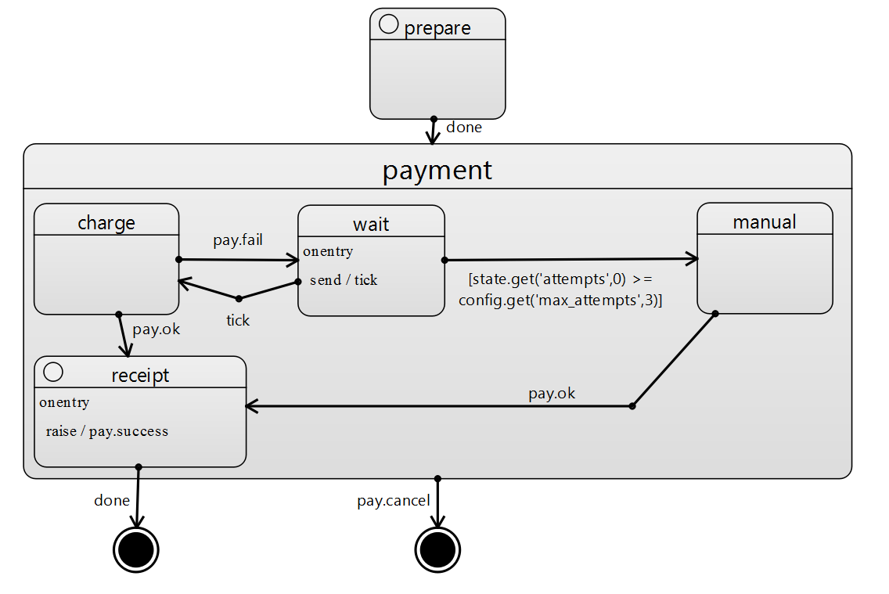

# 3. Loop/Retry: повтор платежа с backoff

## Сценарий

**Кейс: автоматическая обработка обращений в банк**

Клиент отправляет заявление на оплату товара (prepare).
ИИ-агент проверяет данные, отправляет запрос во внутренние системы и может получить временную ошибку.
Система автоматически повторяет попытку несколько раз (charge/wait), прежде чем эскалировать оператору (manual).
Оркестратор делает до `max_attempts` попыток с ожиданием между ними.

## Демонстрируется

- Иерархия состояний
- Таймер внутренний
- Условные переходы
- Общий выход из подсостояний

## Как работает LangGraph

Встроенной реализации нет, в примере показан пример обходного решения.

## Как работает Statechart

Ожидание (wait) после неудачной оплаты длится 1 с, т.е. запускается внутренний таймер, который через по завершения генерирует событие tick,
переводящие систему в снова состояние оплаты (charge)

## Преимущества Statechart

### Переход из родительского состояния

В SCXML отмена в любой момент является частью модели. Достаточно один раз объявить глобальный переход `cancel`, и движок гарантирует обработку события независимо от текущего состояния процесса. Активное состояние является встроенным понятием модели, поэтому система всегда знает, где именно находится выполнение и какие переходы допустимы.

В LangGraph такого механизма нет. Граф описывает последовательность вызовов функций, но не управляет активными состояниями как формальная модель автомата. Чтобы получить поведение отмена в любой момент, необходимо вручную добавлять общий обработчик событий, хранить флаги состояния, проверять отмену после каждого шага и обеспечивать кооперативное прерывание долгих операций. В результате поведение определяется не моделью, а дополнительным управляющим кодом поверх графа.

### Таймер

В SCXML состояние `wait` является полноценным состоянием автомата. Таймер выражается как событие, а отмена оформляется альтернативным переходом. Ситуация, когда одновременно возможны истечение таймера и поступление отмены, описывается на уровне модели и корректно разрешается самим движком.

В LangGraph отсутствует встроенное понятие конкурентных событий и активного состояния. Чтобы реализовать мгновенную отмену во время ожидания, необходимо писать прерываемую логику непосредственно внутри ноды, например через `Event.wait(timeout)`, и дополнительно гарантировать, что проверка отмены выполняется между всеми переходами. Это означает, что корректность процесса зависит не от формальной модели, а от аккуратности реализации.
